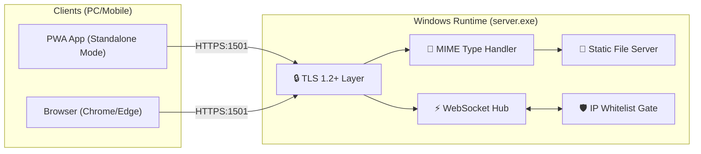

# 🪐 Antigravity Chat Server V5 (專業版)

這是一個為**高資安離線環境**量身打造的極致通訊方案。它將原本複雜的「前端網頁 + 後端 API + Nginx 反向代理」整合進**單唯一支 Windows 原生執行檔 (`server.exe`)** 中。

---

## 🏗️ 系統架構簡圖 (Architecture Overview)



---

## 📘 應用程式系統架構設計文件 (SA Document)

### 1. 技術棧與規範 (Tech Stack)
*   **前端 (Frontend)**: React 18, Vite, Tailwind CSS, DaisyUI (Glassmorphism 風格).
*   **後端 (Backend)**: Go (Golang) 1.21+ (原生靜態編譯).
*   **通訊 (Communication)**: WebSocket (ws/wss) 實時雙向傳輸.
*   **安全 (Security)**: TLS 1.2+ 強制、IP 白名單動態熱載入、MIME 類型硬註冊、PWA 持久化快取。

### 2. 核心模組設計 (Module Design)

#### A. 統一進入點 (Single Binary Gateway)
不同於傳統分散式架構，`server.exe` 同時扮演 **HTTP File Server** 與 **API/WS Server**。
*   **靜態資源管理**: 接管 `dist/` 目錄，自動處理 React Router 的跳轉邏輯。
*   **多媒體服務**: 接管 `uploads/` 目錄，提供 50MB 等級的檔案與圖片存取。

#### B. 即時通訊引擎 (WS Hub)
*   **狀態廣播系統**: 基於異步 Channel 分發，當用戶發送狀態更新時，後端會將全體名單（含狀態）重新推送到所有連線端。
*   **持久化訊息鏈**: 最近 20 筆聊天紀錄暫存於記憶體，新進入者可秒速獲取上下文。

#### C. 五層安全防護體系 (5-Layer Security)
1.  **Transport 層**: 強制 TLS 1.2 握手，杜絕 SSLStrip 等降級攻擊。
2.  **Network 層**: 基於 `X-Real-IP` 或 `RemoteAddr` 的白名單過濾，非許可 IP 無法載入任何資源。
3.  **Application 層**: MIME Sniffing 防止惡意腳本執行。
4.  **Privacy 層**: 內建閒置 60 秒「啦啦隊螢幕保護程式」，防止實體監視。
5.  **Offline 層**: 0 CDN 依賴，確保連內部網路物理隔離時仍能 100% 正常運作。

### 3. 資料流向圖 (Data Flow)

#### 訊息傳遞路徑:
1.  **Input**: 用戶在 PWA 介面輸入文字、上傳圖片或 `Ctrl+V` 貼上圖檔。
2.  **Upload (if file)**: 透過 `POST /api/upload` 存入本地 `./uploads/`，檔名採 `timestamp-filename` 命名防撞。
3.  **WS Submit**: 透過 WebSocket 傳送 JSON 格式封包（含 `TEXT` 或 `STATUS`）。
4.  **Broadcast**: 指令被推入 Go 的廣播 Queue。
5.  **Output**: 所有活躍中的 WebSocket 客戶端接收到資訊並以動態磁貼 (Toast) 或氣泡通知呈現。

---

## 🌟 亮點功能 (Feature Highlights)

*   **PWA 獨立視窗 (Standalone Mode)**：支援安裝至工作列，擁有專屬圖示，不再與瀏覽器分頁混淆。
*   **個人狀態同步**：使用者可隨時編輯狀態（如「開會中」），WebSocket 全域即時同步。
*   **李多慧/李雅英 專屬 Screensaver**：一鍵開啟韓籍啦啦隊應援輪播，緩解工作壓力。
*   **SNAKE OS**：整合於極致美學面板中的隱藏版貪吃蛇遊戲。

---

## 🚀 部署與啟動 (Deployment Guide)

### 1. 取得執行檔
👉 **`vibe-code-windows-release-v5.tar`** (內含 V5 專業版所有組件)

### 2. 卸載並啟動
```powershell
docker load -i vibe-code-windows-release-v5.tar
docker run --rm -v D:/YourFolder:/host vibe-code-windows-release-v5
# 卸載後進入該資料夾
.\server.exe
```
*   **存取路徑**: `https://[您的IP]:1501/vibe-code/`
*   **管理員權限**: 當 IP 被對應到 `whitelist.json` 中的 `Admin` 時，介面會自動啟動「實時軌跡監控」面板。

---

## 📦 目錄權責清單
- `server.exe`: 核心大腦、靜態服務與安全閘道。
- `whitelist.json`: 用戶身分與 IP 對應表（支援熱更新）。
- `dist/`: 經過 Vite 編譯、內建持久化 Service Worker 的 UI。
- `uploads/`: 使用者傳出的檔案存儲區。

---

## 🛡️ 維護指南
如果您看到 `⚠️ 拒絕連線` 的警告，請直接編輯目錄下的 `whitelist.json` 並存檔，系統將在 **3 秒內自動熱載入**。
