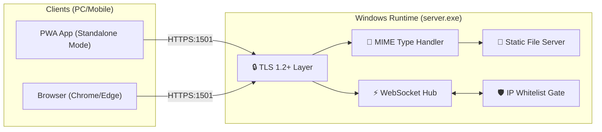

# 🪐 Antigravity Chat Server V5 (專業版)

這是一個為**高資安離線環境**量身打造的極致通訊方案。它將原本複雜的「前端網頁 + 後端 API + Nginx 反向代理」整合進**單唯一支 Windows 原生執行檔 (`server.exe`)** 中。

---

## 🏗️ 系統架構簡圖 (Architecture Overview)

---

## 🛠️ 三階段自動化編譯流程 (Detailed Build Stages)

本專案採用 Docker Multi-stage Build 技術，確保編譯環境與產物完全隔離，以下為各階段詳細說明：

### 第一階段：前端靜態構建 (Frontend Build)
*   **使用 Image**: `node:20-alpine` (輕量化 Node.js 環境)
*   **任務**: 
    1.  載入 React 18 原始碼。
    2.  執行 `npm install` 安裝依賴。
    3.  執行 `npm run build` (Vite)，將 JSX/TSX 優化、壓縮並打包成純靜態 HTML/JS/CSS。
*   **產物指標**: 產出位於 `/dist` 目錄的優化後資源。

### 第二階段：後端交叉編譯 (Backend Cross-Compile)
*   **使用 Image**: `golang:1.21-alpine` (Go 語言官方編譯環境)
*   **任務**:
    1.  載入 Go 原始碼，並執行 `go mod download` 預熱依賴。
    2.  設定環境變數 `GOOS=windows` 與 `GOARCH=amd64`。
    3.  執行 `go build`：在 Linux 容器內，將 Go 代碼編譯成 **Windows 原生可執行二進位檔**。
*   **產物指標**: 產出具備高性能、單一檔案特性的 `server.exe`。

### 第三階段：快遞母艦封裝 (Payload Packaging)
*   **使用 Image**: `alpine:latest` (極致輕量的 Linux 散佈版)
*   **任務**:
    1.  **物資收集**：從前兩個階段的容器中，分別把 `dist/` (前端) 與 `server.exe` (後端) 提取出來，存入容器內的 `/payload` 目錄。
    2.  **腳本注入**：寫入自動卸載 (Unload) 指令。
*   **最終打包**: 將此 Image 導出為 `vibe-code-windows-release-v5.tar`。

---

## 🚚 快遞卸載邏輯 (Deployment Process)
本專案的 Docker Image 並非用來「運行程式」，而是作為一個「會自動把檔案吐出來」的載體：

1.  **使用者執行**: `docker run --rm -v D:/MyPath:/host vibe-code-windows-release-v5`
2.  **Image 行為**: 啟動後立刻執行 `cp -r /payload/* /host/`。
3.  **結果**: 所有的 Windows 產物會出現在主機的 `D:/MyPath` 資料夾，隨後容器自動自我銷毀，不佔用系統資源。

---

## 📘 應用程式系統架構設計文件 (SA Document)

### 1. 技術棧與安全規範
*   **前端 (Frontend)**: React 18 & PWA Offline Persistence.
*   **後端 (Backend)**: Single-binary Native Go (Windowed Mode).
*   **傳輸安全**: 強制 TLS 1.2+、IP 白名單動態偵測。

### 2. 五層安全防護體系 (5-Layer Security)
1.  **Transport 層**: 強制 TLS 握手。
2.  **Network 層**: IP 白名單過濾（熱更新）。
3.  **Application 層**: 原生 MIME 類型註冊，防止 XSS/ORB。
4.  **Privacy 層**: 啦啦隊 Screensaver 防實體監視。
5.  **Offline 層**: 物理斷網環境 100% 獨立運行。

---

## 🚀 最終部署清單 (V5 Contents)
解壓完成後，目錄必須包含：
*   📦 **`server.exe`**: 雙擊即可執行的主程式。
*   📁 **`dist/`**: 包含 UI 介面的網頁資料夾。
*   📄 **`whitelist.json`**: IP 管理清單。
*   🔑 **`cert.pem / key.pem`**: SSL 安全憑證。
*   🖼️ **`uploads/`**: 檔案存儲目錄。
