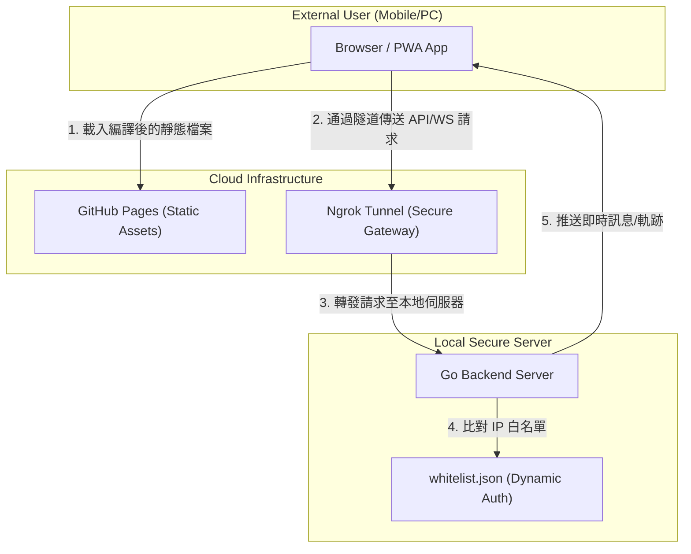

# 🪐 Antigravity React Chat Room

這是依據 Antigravity 專案開發規範建置的高級感全端聊天室。採用 **React (Vite)** 靜態前端與 **Go (Gorilla WebSocket)** 後端的解耦架構，實現了即使在 GitHub Pages 也能對接私人伺服器的動態通訊方案。

---

## 🏗️ 系統架構圖 (System Architecture)



---

## 🚀 核心章節與使用方法

### 1. 極致視覺與 PWA 體感  
*   **使用方法**：使用支援 PWA 的瀏覽器（如 Chrome/Edge）開啟網站，點擊網址列右側的「安裝」按鈕。  
*   **用途**：將網頁轉化為獨立 Window 運行的桌面 App。支援「背後執行」與「系統級通知音效」，確保您在處理其他事務時不會錯過任何加密通訊。

### 2. 動態連線大門 (`?server=`)  
*   **使用方法**：分享網址時附帶參數，例如 `https://hao105.github.io/vibe-code/?server=您的Ngrok網址`。  
*   **用途**：**解決靜態網站無法對接動態 IP 的痛點**。這讓您的朋友不需要任何設定，點開連結就能自動指向您的私人伺服器。

### 3. 安全白名單熱更新  
*   **使用方法**：直接編輯 `server/whitelist.json` 加入新成員的 IP（伺服器終端機會主動提示拒絕連線的 IP）。  
*   **用途**：提供**零停機時間**的成員管理。當管理員 (Admin) 登入時，還能開啟隱藏的「實時軌跡監控」面板。

---

## 🛠️ 建置與部署流程 (Build & Deployment)

### 第一階段：自動化前端部署
本專案已整合 GitHub Actions。您只需要完成以下一次性設定：
1. **GitHub 設定**：前往 Repo 的 `Settings -> Pages -> Build and deployment`，將 Source 的 `Branch` 設為 **`gh-pages`**。
2. **自動觸發**：以後只要 `git push` 到 `main` 分支，GitHub 就會自動執行編譯並更新您的網站。

### 第二階段：後端伺服器啟動
1. 進入 `server` 資料夾，執行：
   ```powershell
   go run main.go
   ```
2. 啟動 Ngrok 隧道以獲取公網 HTTPS 網址：
   ```powershell
   ngrok http https://localhost:8080
   ```

### 第三階段：通行證激活 (Ngrok 限制繞過)
**這一步對於外部用戶至關重要：**
1. 由於 Ngrok 免費版會攔截 WebSocket 請求，請先用瀏覽器**手動訪問一次**您的 Ngrok Forwarding 網址。
2. 點擊畫面上的藍色按鈕 **"Visit Site"**。
3. 關閉該頁面，回到聊天網頁。現在所有的加密連線都將被放行。

---

## 📦 目錄架構
- `/src`: 前端 UI 核心與動態 API 邏輯。
- `/server`: Go 伺服器原始碼、SSL 憑證與動態名單。
- `/public`: 機器人圖示、Service Worker 與 Manifest。
- `.github`: CI/CD 行動定義碼。

---

## 🛡️ 維護指南
如果您看到 `⚠️ 拒絕連線(WS)` 時，請複製終端機顯示的 IP 並加至 `whitelist.json`。系統會在 3 秒內自動偵測並放行。
